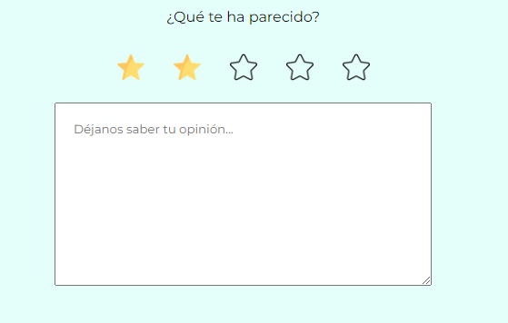
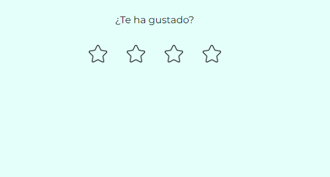

# ✨ Star Rating

:star::star::star::star::star:

This is a project that I have done with Lit Element and Web Components technologies to learn and practice. I have made a component called ```<cris-rating>``` to build a star ranking for any web page that needs it.

 

## 📋 Initial Requeriments

- Create a component called ```<cris-rating></cris-rating>```
- Paint title, with the text attribute or set a default property.
- Paint as many stars as you want with the star-count attribute.
- Use the rating to fill in that number of stars.
- If you have a rating, a text box should appear below to leave more comments.

## 🔨 Built with 

- **Visual Studio Code**
- **HTML**
- **Java Script** 
- **Lit Element**
- **Web Components**

## Installation

```bash
npm i cris-rating
```

## Usage

```html
<script type="module">
  import 'cris-rating/cris-rating.js';
</script>

<cris-rating></cris-rating>
```

## Linting and formatting

To scan the project for linting and formatting errors, run

```bash
npm run lint
```

To automatically fix linting and formatting errors, run

```bash
npm run format
```

## Demoing with Storybook

To run a local instance of Storybook for your component, run

```bash
npm run storybook
```

To build a production version of Storybook, run

```bash
npm run storybook:build
```


## Tooling configs

For most of the tools, the configuration is in the `package.json` to minimize the amount of files in your project.

If you customize the configuration a lot, you can consider moving them to individual files.

## Local Demo with `web-dev-server`

```bash
npm start
```

To run a local development server that serves the basic demo located in `demo/index.html`

## 🐑🐑 Want to clone my repository?

Go for it! And if you make something pretty, please show me
  
## ✏️ Do you have any idea? 

I'm an student and as I stated before am learning a whole lot of Front End Developing, so, if  you have any idea that I could develope please tell me so and I will try to.

## 🙍‍♀️ Autor

[)](https://github.com/crisrodriguezgar)

## 🏆 Codefactor

[](https://www.codefactor.io/repository/github/crisrodriguezgar/star-rating/overview/main)

### Enjoy it!
